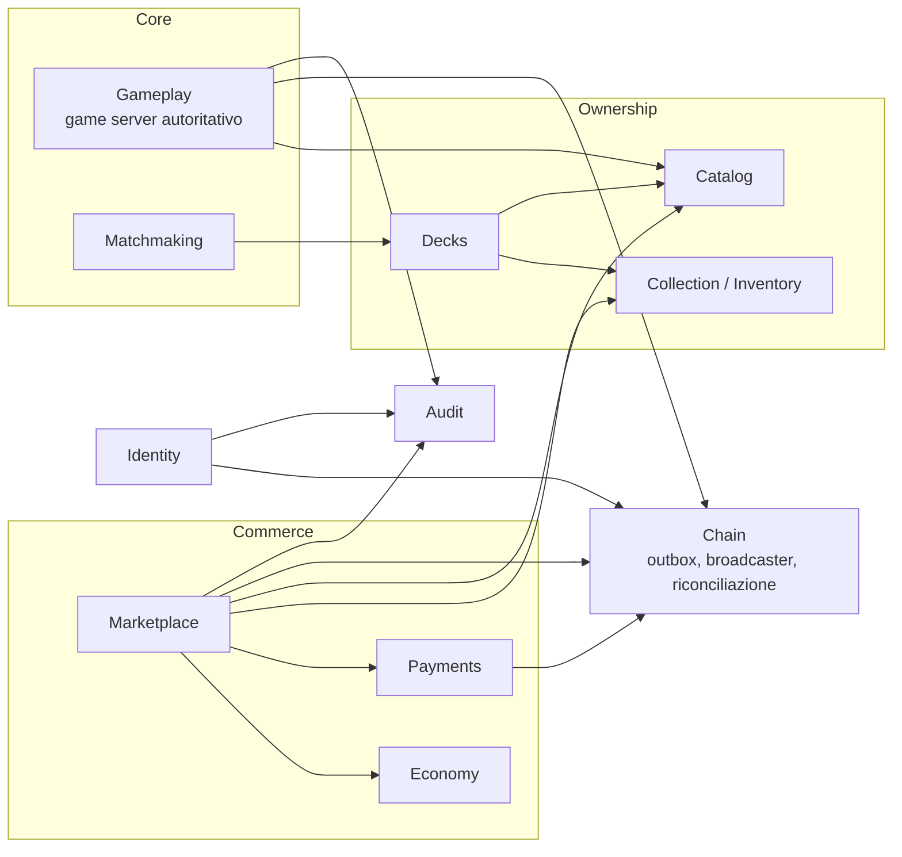
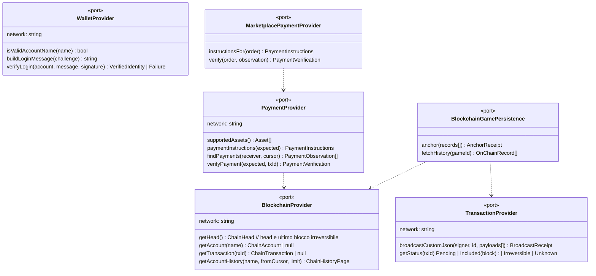
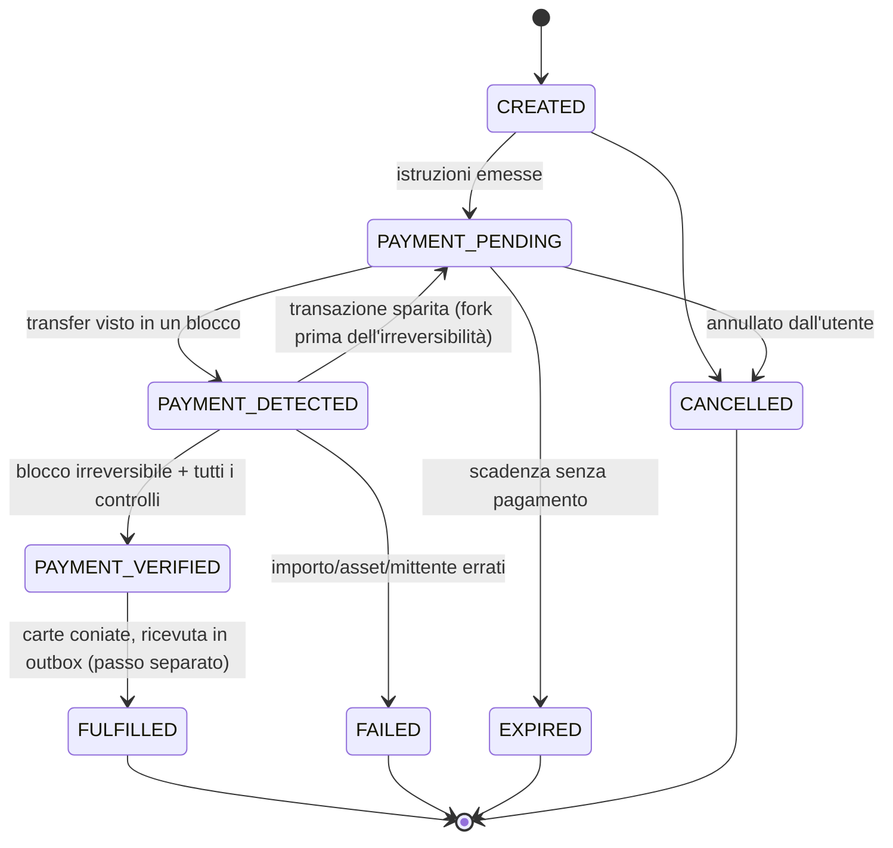
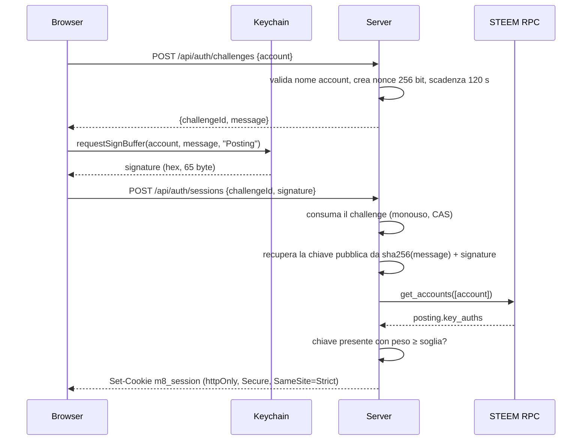
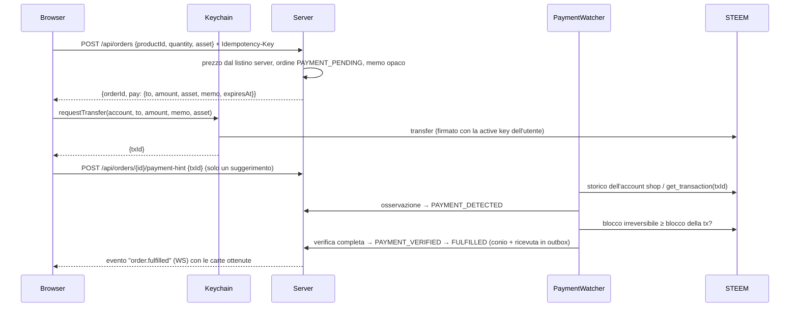
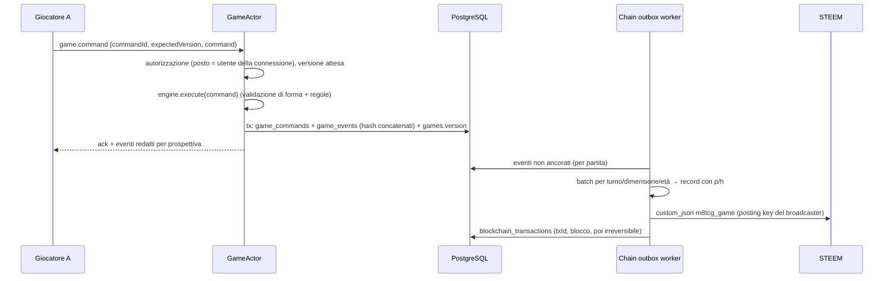

# 01 — Architettura, bounded context e domain model

**Stato:** proposta, 2026-09-24.

## 1. Principi

1. **Il client non è mai autorevole.** Invia intenzioni; il server decide. Prezzi, inventario, esiti e ricompense si calcolano solo sul server.
2. **Il dominio non conosce l'infrastruttura.** Nessun modulo di dominio importa STEEM, HTTP, WebSocket, SQL, orologi o generatori casuali: li riceve come *porte* (interfacce) iniettate.
3. **La blockchain è un adattatore.** Il gioco dipende da `BlockchainProvider`, `PaymentProvider`, … e non da STEEM. Aggiungere un'altra rete significa scrivere un nuovo adattatore e registrarlo, senza modificare il dominio (OCP).
4. **Il DB è lo stato operativo, la catena è il notaio.** Ogni scrittura on-chain nasce da un'*outbox* transazionale nel DB e viene riconciliata.
5. **Configurazione e contenuti sono dati** (carte, regole, prodotti, drop table, prezzi), validati al caricamento come input non fidati.
6. **Idempotenza ovunque ci sia denaro o stato di partita:** ogni comando sensibile porta una chiave di idempotenza e ogni transizione di stato è un compare-and-set.

## 2. Glossario (linguaggio ubiquo per contesto)

| Termine | Contesto | Significato |
|---|---|---|
| `CardDefinition` | Catalog | Le caratteristiche di una carta (costo, statistiche, abilità, rarità, set). Immutabile una volta pubblicata; una modifica di bilanciamento è una nuova versione dei contenuti. |
| `CardInstance` | Collection | Una **copia posseduta**: id univoco, definizione, edizione, numero di serie, finitura (standard/foil), proprietario, origine (acquisto, pacchetto, omaggio). Predisposta per trading P2P e NFT (`externalRef`). |
| carta in partita | Gameplay (motore) | Nel motore la classe si chiama ancora `CardInstance` (eredità di magic8): è la carta *dentro una partita*, con id `c1…cN` allocati deterministicamente. Non ha relazione diretta con la copia posseduta. |
| `Deck` | Decks | Lista `definizione → quantità` di un utente; legale se rispetta le regole **e** l'utente possiede abbastanza copie. |
| `Product` | Marketplace | Qualcosa che si vende: carta singola, booster, mazzo, starter, bundle. Generico e data-driven: un prodotto è un elenco di *contenuti* (carte, pacchetti, mazzi, altri prodotti). |
| `Order` | Marketplace | Richiesta d'acquisto con prezzo congelato al momento della creazione, istruzioni di pagamento e macchina a stati. |
| `Money` | Economy | Importo **intero** nell'unità minima dell'asset (STEEM ha 3 decimali: `1.000 STEEM` = 1000). Mai numeri in virgola mobile. |
| `Game` | Gameplay | Una partita: posti, mazzi congelati, comandi, eventi, checkpoint, stato di ancoraggio on-chain. |
| `Seat` | Gameplay | Posto al tavolo (`s0`, `s1`); è l'id del giocatore nel motore. |
| Record | Chain | Un blocco di eventi di una partita concatenato crittograficamente, pubblicato in un `custom_json`. |

## 3. Bounded context (modular monolith)



| Contesto | Responsabilità | Possiede le tabelle | Porte principali |
|---|---|---|---|
| **Identity** | Challenge di login, verifica firma wallet, utenti, sessioni, revoca | `users`, `auth_challenges`, `sessions` | `WalletProvider` |
| **Catalog** | Definizioni carte versionate, regole, contenuti per hash | `card_definitions`, `content_versions` | — |
| **Collection** (`InventoryService`) | Coniare, possedere, bloccare copie; storia di ogni copia | `card_instances`, `card_instance_events`, `collections` (vista) | — |
| **Decks** | Mazzi utente, validazione regole + possesso | `decks`, `deck_cards` | — |
| **Economy** (`EconomyService`) | Asset, `Money`, listini, quote di prezzo, (futuro) ricompense | `products.prices` (dati) | `PriceSource` |
| **Marketplace** (`MarketplaceService`) | Prodotti, ordini, fulfilment, pacchetti provably-fair | `products`, `product_items`, `orders`, `order_items`, `rng_epochs` | `MarketplacePaymentProvider` |
| **Payments** | Rilevare e verificare pagamenti on-chain, rimborsi | `payments`, `refunds` | `PaymentProvider` |
| **Matchmaking** | Code, accoppiamento, ticket | `matchmaking` | — |
| **Gameplay** | Attore per partita, comandi, timer, snapshot per prospettiva, reconnect | `games`, `game_players`, `game_commands`, `game_events`, `game_snapshots` | `GameClock`, `BlockchainGamePersistence` |
| **Chain** | Outbox, batching, broadcast, conferme, riconciliazione, cursori di lettura | `blockchain_transactions`, `blockchain_events`, `chain_cursors` | `BlockchainProvider`, `TransactionProvider` |
| **Audit** | Registro append-only delle operazioni sensibili | `audit_logs` | — |

**Regole di confine** (verificate da test di architettura come in magic8):
- un modulo accede alle tabelle di un altro modulo **solo** tramite il suo servizio applicativo pubblico, mai via SQL diretto;
- un modulo non importa i file `domain/` o `infrastructure/` di un altro modulo, solo il suo `index.js` pubblico;
- `domain/` di ogni modulo non importa nulla fuori da `domain/` e dal kernel condiviso.

Questi confini permettono di separare in futuro processi distinti (API, game server, matchmaking, chain worker) sostituendo le chiamate in-process con messaggi, senza toccare il dominio.

## 4. Pacchetti del monorepo

```
packages/
  engine/     @magic8/engine    regole del gioco (da magic8). Puro, deterministico, zero dipendenze.
  protocol/   @magic8/protocol  JSON canonico, hashing, Game Blockchain Protocol: costruzione record,
                                verifica catena, replay. Puro; gira in Node e nel browser (verifica pubblica).
  steem/      @magic8/steem     adattatore STEEM: client RPC con failover, chiavi e firme (secp256k1),
                                serializzazione transazioni, implementazioni delle porte blockchain.
  server/     @magic8/server    modular monolith: moduli per bounded context, HTTP + WebSocket, PostgreSQL.
  client/     @magic8/client    client canvas (da magic8) + connettore Keychain + sessione remota.
data/                           contenuti condivisi: carte, mazzi, regole, prodotti, drop table.
docs/
```

Dipendenze tra pacchetti (acicliche):

```
client ──► engine, protocol
server ──► engine, protocol, steem
steem  ──► protocol (solo tipi/codec condivisi)
protocol ──► engine (per il replay)
```

**Dipendenze esterne ammesse**, ciascuna motivata:

| Pacchetto npm | Usato da | Perché non la scriviamo noi |
|---|---|---|
| `@noble/hashes`, `@noble/curves` | protocol, steem | SHA-256, RIPEMD-160, secp256k1 con recupero della chiave pubblica. Librerie auditate, zero dipendenze, funzionano sia in Node sia nel browser. La crittografia fatta in casa è la prima fonte di vulnerabilità. |
| `ws` | server | Server WebSocket (Node 22 ha il client ma non il server). Zero dipendenze. |
| `pg` | server | Driver PostgreSQL con query parametrizzate. |

Non usiamo `steem-js`/`dsteem`: sono pesanti, poco manutenuti e portano dipendenze vecchie. Serializzazione e firma di **due soli tipi di operazione** (`custom_json`, e in lettura `transfer`) stanno in poche centinaia di righe testate contro transazioni reali della catena: l'id di una transazione STEEM è l'hash della sua serializzazione, quindi il test si autoverifica.

## 5. Strati dentro il server

```
Presentation   http/ (router, cookie, CSRF, rate limit)   ws/ (connessioni, messaggi, backpressure)
     │
Application    servizi per caso d'uso: AuthService, DeckService, MarketplaceService, GameService, …
     │         orchestrano repository e porte dentro una UnitOfWork; nessuna logica di regola
Domain         entità, value object, macchine a stati, policy (DeckPolicy, OrderStateMachine, PackOpener)
     │         puro, testabile senza I/O
Infrastructure repository PostgreSQL, adattatori STEEM, orologio, CSPRNG, logger
```

Ogni modulo ha la stessa forma:

```
modules/marketplace/
  domain/          Order.js, OrderStatus.js, Product.js, PackOpener.js …
  application/     MarketplaceService.js, ports.js
  infrastructure/  PgOrderRepository.js
  http/            rotte del modulo
  index.js         API pubblica del modulo (unico import consentito agli altri moduli)
```

**Una sola implementazione dei repository, su PostgreSQL vero anche nei test.** Il progetto iniziale prevedeva repository in-memory con la stessa suite di contratto; l'abbiamo scartato. Due implementazioni divergono proprio dove conta: vincoli di unicità, trigger append-only, compare-and-set, rollback. Nei test e in sviluppo gira invece **PGlite**, cioè PostgreSQL 18 compilato in WebAssembly dentro il processo Node: stessi vincoli, trigger e transazioni della produzione, senza Docker.
- Ogni file di test migra un database una volta sola e lo svuota con `TRUNCATE` prima di ogni test.
- PGlite ha una sola sessione. La concorrenza vera fra connessioni (lock di riga, `SERIALIZABLE`) va verificata anche contro un PostgreSQL server prima del lancio (M6).

**UnitOfWork.** `Database.transaction(fn)` apre una transazione su una connessione e, con `AsyncLocalStorage`, vi fa confluire ogni query eseguita durante `fn`, anche dai servizi di altri moduli. Un caso d'uso che attraversa più moduli (per esempio lo starter: conio delle carte, creazione del mazzo, audit) va in commit tutto insieme o per niente, e i moduli continuano a chiamarsi solo attraverso le API pubbliche. I servizi applicativi ricevono la funzione `unitOfWork`, non il database.

## 6. Le astrazioni blockchain

Tutte le porte sono indipendenti dalla rete. I tipi che attraversano le porte sono DTO neutri (`ChainAccount`, `ChainTransfer`, `ChainBlockRef`, `Money`), mai oggetti STEEM. Un `BlockchainRegistry` associa un identificatore di rete (`"steem"`) alle implementazioni, così più reti possono convivere (per esempio pagamenti accettati su due catene).



| Porta | Responsabilità unica (SRP) | Implementazione STEEM v1 |
|---|---|---|
| `BlockchainProvider` | Letture: head, blocco irreversibile, account e chiavi, transazioni, storico account | `SteemBlockchainProvider` su `SteemRpcClient` (failover, timeout, validazione delle risposte) |
| `WalletProvider` | Prova di controllo di un account: messaggio di login e verifica della firma | `SteemWalletProvider`: recupera la chiave pubblica dalla firma Keychain e la cerca nell'autorità posting dell'account |
| `TransactionProvider` | Firma e broadcast di operazioni **dagli account del gioco** (mai degli utenti) | `SteemTransactionProvider`: serializzazione + firma secp256k1 canonica con la posting key del broadcaster |
| `PaymentProvider` | Rilevare e verificare pagamenti in ingresso rispetto a un'aspettativa (destinatario, asset, importo, memo, mittente) | `SteemTransferPaymentProvider`: legge lo storico dell'account shop, conferma solo sotto il blocco irreversibile |
| `MarketplacePaymentProvider` | Tradurre un `Order` in istruzioni di pagamento e verificarlo | Generica: compone un `PaymentProvider` scelto per rete; non dipende da STEEM |
| `BlockchainGamePersistence` | Ancorare record di partita e rileggerli dalla catena | `SteemGamePersistence`: `custom_json` `m8tcg_game` via `TransactionProvider`, lettura via `BlockchainProvider` |

Lato browser c'è una porta speculare, **`WalletConnector`** (`KeychainWalletConnector` in v1): `signLogin(account, message)`, `requestPayment(instructions)`. Il client non costruisce mai l'importo o il destinatario: li riceve dal server nelle istruzioni di pagamento dell'ordine.

## 7. Domain model

### 7.1 Collection

```
CardInstance
  id            UUID v4 (non indovinabile)
  definitionId  riferimento a CardDefinition
  edition       es. "core-1"
  serial        intero progressivo per (definitionId, edition), assegnato dal DB
  finish        "standard" | "foil"          (estendibile: data-driven)
  ownerId       utente
  status        "active" | "locked" | "burned"
  origin        { kind: "purchase" | "pack" | "grant" | "reward", ref: orderId | grantKey }
  mintedAt
  externalRef   null  (futuro: token id su una catena)
```

Ogni cambio di proprietario o stato genera un `card_instance_events` (append-only): la storia completa di ogni copia è ricostruibile, requisito per trading P2P e NFT futuri.

`InventoryService.mint(grants, origin)` è l'**unico** modo di creare copie ed è chiamato solo dentro la UnitOfWork del fulfilment o di un omaggio idempotente (chiave univoca di origine). Nessun endpoint consente di creare carte.

### 7.2 Marketplace

```
Product  (data-driven, data/products/*.json)
  id, kind: "single" | "booster" | "deck" | "starter" | "bundle" | …  (etichetta di presentazione)
  prices:   [{ asset: "STEEM", amount: "5.000" }, { asset: "SBD", amount: "1.200" }]
  contents: [ { type: "card",    definitionId, count, finish? }
            , { type: "pack",    dropTableId, count }
            , { type: "deck",    deckId, finish? }
            , { type: "product", productId, count } ]            ← bundle = composizione
  limits:   { perUser?, total?, availableFrom?, availableUntil? }
  active

DropTable (data/drop-tables/*.json)
  slots: [ { count: 3, weights: { common: 1 } }, { count: 1, weights: { uncommon: 1 } },
           { count: 1, weights: { rare: 88, epic: 10, legendary: 2 } } ]
  foilChance: { numerator: 1, denominator: 20 }
  pool: definizioni per rarità (dal catalogo, filtrate per set)
```

Il `kind` non guida la logica: il fulfilment espande ricorsivamente i `contents` (con limite di profondità e di carte totali). Un nuovo tipo di prodotto è quasi sempre solo un nuovo JSON.

I prodotti del catalogo standard non si scrivono a mano: li genera il **listino** (`data/economy/pricing.json`, `PriceList.js`) all'avvio, e passano dalla stessa validazione dei file in `data/economy/products/` (che restano per offerte speciali e prodotti ritirati):

```
pricing.json
  asset, edition
  singles: { perOrder, prices: { <rarità>: { standard, foil? } } }   → single_<carta>, single_<carta>_foil
  packs:   [ { id, name, description, dropTable, price, perOrder } ] → un prodotto per pacchetto, prezzo fisso
  decks:   { perOrder }                                              → deck_<mazzo>, prezzo = Σ carte × prezzo singola standard
```

Ogni rarità deve avere un prezzo, così ogni carta è in vendita e ogni mazzo ha un prezzo. Gli id generati sono stabili: cambiare un prezzo non tocca gli ordini già creati, che hanno il prezzo congelato.

**Macchina a stati dell'ordine** (transizioni esplicite, ogni transizione è un `UPDATE … WHERE status = <atteso>`):



Un pagamento arrivato per un ordine `EXPIRED`, `CANCELLED` o `FAILED`, oppure con importo diverso, non viene mai "assorbito": diventa un `payments` con stato `REFUND_REQUIRED` e compare nella coda rimborsi dell'admin.

**Due passi, entrambi atomici.** La verifica del pagamento (`PaymentSettlement`: pagamento `APPLIED`, ordine `PAYMENT_VERIFIED`) e l'evasione (`FulfilmentService`: `PAYMENT_VERIFIED → FULFILLED`, conio, mazzi salvati, ricevuta nell'outbox, audit) sono due unità di lavoro distinte. Un errore di evasione (un bug, una chiave non disponibile) lascia l'ordine verificato e viene ritentato; non può mai far perdere un pagamento già verificato né coniare due volte.

**Quando un pagamento è in tempo.** Decide il timestamp del blocco del transfer, non l'ora in cui il watcher lo vede: un ordine scade solo 10 minuti dopo la scadenza mostrata al giocatore, e un transfer entrato in un blocco entro la scadenza lo paga anche se letto dopo.

**Pacchetti provably fair.** Per ogni *epoca* il server genera un segreto di 32 byte e pubblica on-chain (`m8tcg_manifest`) il suo hash prima di vendere. Il seed di un pacchetto è `HMAC-SHA256(segreto_epoca, orderId ‖ txIdPagamento ‖ indicePacchetto)`: il server non conosce il txId prima del pagamento, l'utente non conosce il segreto. A fine epoca il segreto viene rivelato e chiunque può ricalcolare il contenuto di ogni pacchetto dalla ricevuta on-chain. Il segreto si rivela solo quando **nessun ordine dell'epoca è ancora pagabile**: con il segreto noto, chi deve ancora pagare potrebbe provare varianti della propria transazione (l'id cambia con la scadenza della transazione) finché il seed dà un pacchetto buono. I segreti sono cifrati nel DB con AES-256-GCM (`SecretBox`, chiave `M8_DATA_KEY` fuori dal DB).

### 7.3 Gameplay

```
Game
  id, mode ("casual" | "ranked" | "practice"), status (CREATED → ACTIVE → FINISHED | ABORTED)
  contentHash, engineVersion, protocolVersion
  seats: [ { seat: "s0", userId, account, deckSnapshot, entropy }, … ]
  secret (cifrato a riposo, rivelato on-chain a fine partita)
  version (versione del motore), lastEventSeq, chainHead
```

Un **`GameActor`** per partita attiva serializza tutti gli input (comandi dei giocatori, timeout, disconnessioni) in una mailbox: un solo comando alla volta, quindi niente race condition sullo stato della partita. Per ogni comando accettato, nella stessa transazione DB: salva il comando (chiave di idempotenza), gli eventi di protocollo con hash concatenato, aggiorna `games.version`; poi notifica i giocatori con snapshot per prospettiva.

Recupero dopo crash: si ricostruisce il motore rigiocando i comandi salvati a partire dal seed (qualche millisecondo per partita). Gli `game_snapshots` salvano solo i digest per il confronto, non servono per ripartire.

## 8. Flussi principali

### 8.1 Login con Keychain



### 8.2 Acquisto



### 8.3 Partita



## 9. Scalabilità

- **Game server orizzontali:** ogni partita è posseduta da un solo nodo tramite un *lease* nel DB (`games.owner_node`, `lease_until`); le connessioni WebSocket di quella partita vengono instradate al nodo proprietario. Se il nodo muore, il lease scade e un altro nodo ricostruisce l'attore rigiocando i comandi.
- **Broadcaster:** un pool di account posting, partizionato per `gameId`; ogni operazione aggrega record di più partite fino a 8 KiB. Capacità stimata e limiti in 03 §10.
- **Letture della catena:** un solo `PaymentWatcher` e un solo `ChainReconciler` per rete (lease nel DB), con cursori persistenti: riavvio senza perdite né doppioni.
- **DB:** PostgreSQL; indici sulle chiavi di accesso calde; partizionamento di `game_events` per mese quando cresce.
