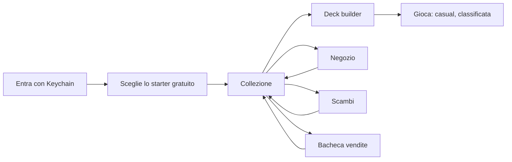
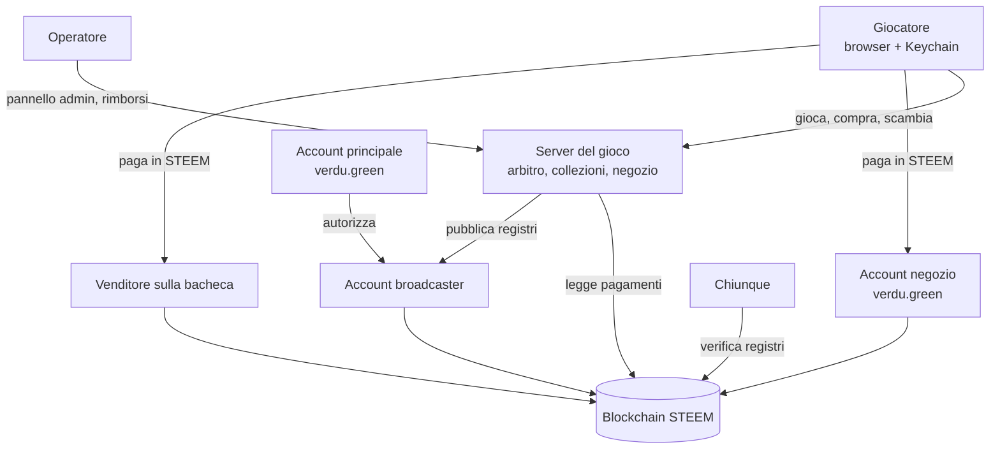

# KIJAM — Panoramica funzionale

**Stato:** 2026-09-30. Descrive il gioco e l'ecosistema così come funzionano oggi, senza dettagli di implementazione. Per il *come* rimanda ai documenti tecnici (00–16).

---

## 1. In breve

KIJAM è un gioco di carte collezionabili **uno contro uno**, giocato nel browser.

- Si gioca con **mazzi di 30–40 carte**, creature e magie di cinque fazioni più le neutrali. Vince chi porta a zero la vita dell'avversario.
- Le carte sono **copie possedute**: ognuna ha un proprietario, un numero di serie e una storia.
- Le carte si ottengono con uno **starter gratuito**, nel **negozio** (pagando in STEEM), con gli **scambi** e comprandole da altri giocatori sulla **bacheca**.
- L'identità è un **account STEEM**: si entra firmando con l'estensione **Steem Keychain**, senza password e senza che la chiave privata lasci il browser.
- La **blockchain STEEM** fa da notaio pubblico: registra acquisti, apertura dei pacchetti, scambi, vendite e risultati delle partite. Le partite si giocano sul server del gioco, che è l'unico arbitro delle regole.

---

## 2. Il gioco

### 2.1 Obiettivo

Ogni giocatore parte con **20 punti vita**. Perde chi scende a 0 o meno. Se entrambi scendono a 0 nello stesso momento, la partita è **pari**. Si perde anche arrendendosi o abbandonando una partita online.

### 2.2 Le carte

| Tipo | Cosa fa |
|---|---|
| **Creatura** | Resta sul campo. Ha un **costo**, un **attacco** e una **salute**. Attacca, blocca e può avere abilità. |
| **Magia** | Si gioca, produce il suo effetto e va nel cimitero. |

**Fazioni:** Ember (fuoco, danni diretti), Iron (costrutti robusti), Shadow (drenaggio, morte, cimitero), Verdant (natura, cure, creature grandi), Arcane (controllo, pescate, rimandare in mano), più le **neutrali**. Il catalogo base (edizione `core-1`) ha 93 carte: 69 creature e 24 magie (Ember 16, Iron 17, Shadow 16, Verdant 18, Arcane 16, neutrali 10).

**Rarità:** comune, non comune, rara, epica, leggendaria. Oggi rispecchiano grosso modo il costo (le leggendarie costano 7) e sono **provvisorie**.

### 2.3 Il mazzo

- Da **30 a 40 carte**, al massimo **3 copie** della stessa carta.
- **Le fazioni si mescolano liberamente**; nessun vincolo di colore. Un mazzo non ha una fazione sua: la striscia colorata a sinistra di ogni mazzo è divisa fra le fazioni delle sue carte, ciascuna in proporzione al numero di carte (per esempio "iron 26 · neutral 4").
- Online si possono usare solo carte **possedute e disponibili**: una copia offerta in uno scambio o messa in vendita è bloccata e non conta.
- Ogni account può salvare fino a 50 mazzi.

Esistono 10 **mazzi precostruiti** da 30 carte (due per fazione): Ember Vanguard, Ember Wildfire, Iron Foundry, Iron Legion, Grave Harvest, Shadow Pact, Verdant Grove, Wild Hunt, Arcane Conclave, Spire Bastion.

### 2.4 Inizio partita

- Ciascuno pesca **5 carte**.
- **Chi inizia si decide a sorte**, in modo che né i giocatori né il server possano sceglierlo.
- Chi inizia **non pesca** nel suo primo turno.

### 2.5 L'energia

L'energia paga il costo delle carte. All'inizio di ogni proprio turno il massimo cresce di **1** (fino a **10**) e l'energia si ricarica del tutto. Al primo turno si ha 1 energia, al secondo 2, e così via.

### 2.6 Il turno

| Fase | Chi agisce | Cosa succede |
|---|---|---|
| Inizio turno | automatica | Energia +1 e ricarica, le proprie creature si rialzano, si pesca 1 carta, scattano le abilità "a inizio turno" |
| Principale 1 | giocatore di turno | Gioca creature e magie |
| Attacco | giocatore di turno | Sceglie quali creature attaccano (o nessuna) |
| Blocco | difensore | Sceglie quali sue creature bloccano quali attaccanti (saltata se nessuno attacca) |
| Danni | automatica | Si risolve il combattimento |
| Principale 2 | giocatore di turno | Gioca altre carte dopo il combattimento |
| Fine turno | automatica | Scadono gli effetti temporanei, si scarta fino a 10 carte in mano, passa il turno |

Il giocatore di turno può chiudere una fase o l'intero turno quando vuole.

### 2.7 Il combattimento

- Una creatura appena giocata **non può attaccare** in quel turno, salvo che abbia **Rapidità** (*Haste*).
- Una creatura che attacca resta **esausta** fino al proprio turno successivo: quindi **non può bloccare** nel turno dell'avversario. Fa eccezione chi ha **Vigilanza** (*Vigilance*): attaccare non la rende esausta, quindi può anche bloccare.
- Ogni creatura non esausta del difensore può bloccare **un solo** attaccante, e ogni attaccante può essere bloccato da **una sola** creatura.
- Attaccante e bloccante si infliggono danni a vicenda pari al proprio attacco. Un attaccante non bloccato colpisce il giocatore.
- Un attaccante con **Sfondare** (*Trample*) bloccato infligge al bloccante solo i danni che bastano a ucciderlo; il resto colpisce il giocatore (5 di attacco contro un bloccante con 2 di salute: 2 al bloccante, 3 al giocatore). Se il bloccante sopravvive, al giocatore non arriva niente.
- **I danni restano**: una creatura ferita non guarisce a fine turno, solo con effetti di cura. Muore quando i danni raggiungono la sua salute.

### 2.8 Abilità ed effetti

Le abilità scattano in quattro momenti: quando la creatura **entra in campo**, quando **muore**, quando si **lancia** una magia, **a inizio turno**.

| Effetto | Significato |
|---|---|
| Danno | Infligge danni a una creatura o a un giocatore |
| Distruggi | Manda una creatura nel cimitero |
| Drena | Infligge danni e chi lo usa recupera altrettanta vita |
| Cura | Restituisce salute a una creatura o vita al giocatore |
| Pesca | Pesca carte |
| Scarta | L'avversario scarta carte a caso dalla mano |
| Macina (*mill*) | Manda carte dal mazzo al cimitero |
| Modifica | Aumenta o riduce attacco e salute (anche solo per il turno) |
| Rimanda in mano | Riporta una creatura in mano al suo proprietario |
| Sacrifica | Manda nel cimitero una propria creatura, come se morisse (le sue abilità "alla morte" scattano) |

Le parole chiave sono tre: **Rapidità** (*Haste*), **Sfondare** (*Trample*) e **Vigilanza** (*Vigilance*). Hanno Sfondare Charging Ram, Thunderhoof Mammoth (Verdant), Molten Rhino (Ember), Siege Ram (Iron) e Rampaging Ogre (neutrale). Hanno Vigilanza Village Militia (neutrale), Rampart Automaton (Iron), Rune Warden (Arcane), Tomb Knight (Shadow) e Oakheart Warden (Verdant).

### 2.9 Limiti

- **Mano:** al massimo 10 carte; a fine turno si scartano le ultime pescate in eccesso.
- **Campo:** al massimo 7 creature per giocatore.
- **Mazzo vuoto (fatica):** ogni pescata da un mazzo vuoto costa 1 punto vita.

### 2.10 Tempi nelle partite online

- **90 secondi** per turno, più una **riserva di 90 secondi** per partita da usare quando il turno non basta.
- **60 secondi** per decidere i blocchi.
- Allo scadere il server fa la mossa minima al posto del giocatore (passa la fase, nessun blocco).
- **Disconnessione:** la partita prosegue. Dopo 60 secondi di assenza il server passa i turni del giocatore assente; dopo 3 turni passati così o 3 minuti di assenza totale, il giocatore perde per abbandono. Chi rientra ritrova la partita esattamente dov'era.

Nelle partite di allenamento contro l'IA non c'è timer.

---

## 3. Modalità di gioco

| Modalità | Serve l'account | Mazzi | Cosa conta |
|---|---|---|---|
| **Allenamento contro l'IA** | No, funziona anche offline | Precostruiti e mazzi salvati nel browser | Niente, è pratica |
| **Casual online** | Sì | Solo mazzi con carte possedute | Il risultato viene registrato |
| **Classificata** | Sì, dopo 3 partite casual finite; un ingresso ranked (1 STEEM) a partita | Come casual | Cambia il rating della stagione |
| **Spettatore** | Sì | — | Si guarda una partita in corso |

**Abbinamento:** la coda mette di fronte i due giocatori in attesa da più tempo, senza guardare il rating. Nessuna attesa forzata.

**Spettatori:** vedono il tavolo ma **mai le mani** (solo quante carte ha ciascuno), quindi non possono aiutare nessuno dei due giocatori. Al massimo 50 per partita, una partita alla volta.

---

## 4. Il percorso del giocatore

1. **Accesso.** Il giocatore scrive il nome del suo account STEEM e firma con Keychain un messaggio del server. Nessuna password, nessuna chiave privata al server. La sessione dura fino a 7 giorni (24 ore di inattività).
2. **Starter gratuito.** Al primo accesso sceglie **uno fra cinque mazzi, uno per fazione**: Ember Vanguard, Iron Foundry, Shadow Pact, Verdant Grove, Spire Bastion (arcane con un po' di iron). Non c'è uno starter neutrale: le carte neutrali sono troppo poche. Il mazzo diventa suo (carte coniate a suo nome) ed è già pronto per giocare. Si riceve una sola volta per account. I cinque sono stati scelti perché, nelle simulazioni, sono i più equilibrati fra loro: ognuno vince fra il 48% e il 51% contro gli altri quattro.
3. **Collezione.** Mostra tutte le copie possedute, con numero di serie, edizione e stato.
4. **Deck builder.** Si costruiscono mazzi con le carte possedute; un mazzo che non rispetta le regole o usa carte non più disponibili non si può portare in partita.
5. **Gioco**, **negozio**, **scambi** e **bacheca**: vedi le sezioni successive.
6. **Notifiche.** Consegne del negozio, scambi ricevuti, accettati o rifiutati, carte vendute o comprate arrivano come avviso in tempo reale e restano in un feed anche se il giocatore non era collegato.

---

## 5. Collezione e proprietà

Ogni carta posseduta è una **copia unica**:

- **carta** (quale definizione del catalogo), **edizione** (`core-1`) e **numero di serie** progressivo per carta ed edizione (la "Ember Imp #4");
- **proprietario**;
- **origine**: acquisto, pacchetto, omaggio (starter), ricompensa;
- **stato**: attiva, oppure bloccata mentre è in uno scambio o in vendita;
- **storia completa**: conio, blocchi, passaggi di proprietà.

Le copie si creano solo quando un acquisto è pagato o un omaggio viene concesso; non esiste altro modo di generare carte. Non esistono versioni "foil" o finiture speciali.

---

## 6. Economia

### 6.1 Principi

- **Una sola valuta: STEEM.** SBD e altri asset non sono accettati.
- **Nessun portafoglio interno.** Il gioco non custodisce fondi: ogni acquisto è un trasferimento diretto dal wallet del giocatore all'account del negozio, firmato con Keychain.
- **Il prezzo lo decide il server**, e resta congelato nell'ordine anche se il listino cambia dopo.

### 6.2 Il negozio

| Scaffale | Cosa si compra | Prezzo (segnaposto) |
|---|---|---|
| **Carte singole** | Qualsiasi carta del catalogo | Per rarità: comune 0,5 · non comune 1 · rara 2,5 · epica 5 · leggendaria 12,5 STEEM |
| **Core Booster** | 5 carte a sorpresa: 3 comuni, 1 non comune, 1 rara o meglio (rara 88%, epica 10%, leggendaria 2%) | 1 STEEM |
| **Core Mini Booster** | 3 carte a sorpresa: 2 comuni, 1 non comune o meglio (non comune 80%, rara 16%, epica 3%, leggendaria 1%) | 0,5 STEEM |
| **Mazzi completi** | Uno dei precostruiti, salvato nell'account pronto per giocare | La somma delle sue carte come singole |

Le probabilità dei pacchetti sono pubbliche e mostrate nel negozio. I prezzi si configurano in un unico file di listino.

### 6.3 Come si compra

1. Il giocatore sceglie prodotti e quantità.
2. Il server crea l'ordine e dice esattamente **quanto pagare, a chi e con quale memo**.
3. Keychain mostra il trasferimento; il giocatore conferma.
4. Il server osserva la blockchain. Quando il pagamento è **irreversibile** (circa un minuto) e due nodi diversi lo confermano, **consegna** le carte e i pacchetti si aprono.
5. Una notifica avvisa della consegna: nel frattempo si può fare altro.

Un pagamento sbagliato (importo diverso, ordine scaduto o annullato, valuta errata) non viene mai trattenuto in silenzio: finisce in una **coda rimborsi** che l'operatore gestisce restituendo i fondi.

### 6.4 Pacchetti verificabili (*provably fair*)

Il contenuto di un pacchetto non si può truccare né da parte del gioco né da parte del giocatore:

- prima di vendere, il gioco pubblica sulla blockchain l'**impronta** di un segreto (una "epoca");
- il contenuto di ogni pacchetto dipende da quel segreto **e** dalla transazione di pagamento, che il gioco non può conoscere in anticipo;
- a epoca chiusa il segreto viene rivelato e **chiunque** può ricalcolare il contenuto di ogni pacchetto venduto partendo solo dalla blockchain.

---

## 7. Scambi fra giocatori

Scambio **carta contro carta**, senza denaro.

- Un giocatore offre fino a 10 sue copie e chiede in cambio fino a 10 carte a un altro giocatore. Chiedere niente equivale a un regalo.
- Le carte offerte restano **bloccate in garanzia** (escrow) finché l'altro non risponde.
- Se il destinatario **accetta**, le carte passano di mano tutte insieme, in un colpo solo. Se **rifiuta**, se il proponente **ritira** l'offerta o dopo **72 ore**, le carte tornano libere.
- Si scambiano carte comprate e carte dello starter; le ricompense no.
- Ogni scambio concluso viene registrato sulla blockchain.

---

## 8. Bacheca delle vendite (market fra giocatori)

Vendita di una carta **in cambio di STEEM**, su una bacheca pubblica visibile anche senza accesso.

1. Il venditore mette in vendita una copia a un prezzo; la copia resta bloccata per al massimo 30 giorni.
2. Un compratore preme "Buy": l'annuncio è **riservato a lui per 15 minuti**.
3. Il compratore paga **direttamente il venditore** con Keychain, con importo e memo indicati dal server.
4. Quando il pagamento è irreversibile, la carta passa al compratore e la vendita viene registrata sulla blockchain.

Il gioco **non tocca mai i soldi** e **non prende commissioni**: il venditore riceve tutto. Il rovescio: se il compratore paga in modo sbagliato, il gioco non può rimborsarlo; deve chiedere al venditore, e blockchain e registro del gioco provano cosa è successo.

---

## 9. Classificata

- **Rating Glicko-2:** si parte da 1500. Un giocatore nuovo sale e scende in fretta, uno esperto si muove poco. Battere un avversario più forte vale di più.
- **Provvisorio:** finché il rating è ancora incerto, il giocatore compare in classifica senza posizione.
- **Stagioni:** a ogni stagione i rating ripartono da capo (oggi: Season 1, dal 1° settembre 2026).
- **Classifica pubblica** dei primi 100.
- **Fair play:** oltre 3 partite classificate al giorno fra gli stessi due giocatori, le successive non contano. Rese rapide e ripetute fra gli stessi giocatori generano segnalazioni per l'operatore. Le segnalazioni informano, non puniscono: l'operatore le controlla prima di pagare i premi di stagione.
- Ogni risultato è pubblico sulla blockchain: chiunque può ricalcolare la classifica.

---
- **Stagioni con jackpot:** Season 1 dura un mese (5 ottobre – 5 novembre 2026). I primi tre della classifica si dividono i 2/3 del wallet della banca (@verdu.green): 65%, 25% e 10%. Il jackpot cresce con ogni pacchetto e ogni ingresso ranked venduto; menu principale e classifica mostrano importo, quote, chi è in testa e il conto alla rovescia (doc 21).
- **Ingressi ranked:** ogni partita classificata costa 1 STEEM a giocatore, e la lobby lo mostra sul pulsante Ranked. Si comprano nello shop (scaffale *Ranked*) quanti ingressi si vuole con un solo trasferimento Keychain; ogni partita ne toglie uno, una partita annullata prima di cominciare lo restituisce. Gli ingressi finiscono nel jackpot (doc 22).

## 10. Il ruolo della blockchain

### 10.1 Cosa viene registrato

| Registro | Quando | Cosa prova |
|---|---|---|
| Manifest | All'avvio, firmato dall'account principale | Quali account possono scrivere a nome del gioco |
| Epoca dei pacchetti | Prima di vendere pacchetti, e alla chiusura | L'impegno sul segreto, poi il segreto stesso |
| Ricevuta | A ogni acquisto consegnato | Chi ha comprato cosa, con quale pagamento, quali copie sono state coniate |
| Scambio | A ogni scambio concluso | Quali copie sono passate fra chi |
| Vendita | A ogni vendita conclusa | Quale copia, a chi, a che prezzo, con quale pagamento |
| Risultato | A ogni partita finita | Giocatori, modalità, vincitore, impronta della storia della partita |

Mettendo insieme ricevute, scambi e vendite si ricostruisce **da chi è passata ogni copia, dal conio a oggi**.

### 10.2 Cosa **non** va sulla blockchain

- **Le mosse delle partite.** Sarebbero troppe e troppo costose. La storia completa resta sul server, concatenata in modo che non si possa modificare senza che cambi l'impronta pubblicata nel risultato.
- **I dati personali.** I memo dei pagamenti sono codici opachi.
- **Lo stato operativo** (collezioni, mazzi, code): vive nel database del gioco.

### 10.3 Garanzie di correttezza nelle partite

- **Mescolamento equo:** il seme casuale nasce da un segreto del server, impegnato prima, e da un contributo di **entrambi** i giocatori. Nessuno può orientare le pescate o scegliere chi inizia.
- **Mosse firmate:** entrando in partita il browser crea una chiave temporanea, autorizzata una volta con Keychain; ogni mossa è firmata. Il server non può inventare mosse a nome di un giocatore.
- **Conferme firmate:** il server conferma ogni mossa accettata con una firma che il giocatore conserva, prova utilizzabile in caso di contestazione.
- **Informazioni nascoste:** ciascun giocatore riceve solo ciò che può vedere (la mano avversaria è solo un numero).

**Limite dichiarato:** durante la partita il server conosce le carte nascoste di entrambi. È inevitabile in un gioco con arbitro centrale.

---

## 11. Attori dell'ecosistema

| Attore | Ruolo |
|---|---|
| **Giocatore** | Possiede un account STEEM e l'estensione Keychain; gioca, compra, scambia, vende |
| **Server del gioco** | Arbitra le partite, tiene collezioni e mazzi, crea ordini, osserva i pagamenti, consegna le carte |
| **Account principale e negozio** (`verdu.green`, provvisorio) | Riceve i pagamenti del negozio e autorizza i broadcaster. **Le sue chiavi non stanno mai sul server** |
| **Broadcaster** | Account dedicati che pubblicano i registri; sul server hanno solo la chiave "posting", che non può muovere fondi |
| **Operatore** | Usa il pannello admin: rimborsi (firmati a mano con Keychain), allarmi, registro di audit, segnalazioni di fair play |
| **Chiunque** | Può leggere la blockchain e verificare pacchetti, ricevute, scambi, vendite e risultati |

Anche se il server venisse compromesso, un attaccante non potrebbe spostare fondi: il server non possiede chiavi che lo permettano.

---

## 12. Punti aperti

- **Prezzi e rarità** sono segnaposto, da decidere con il game design prima dell'apertura.
- **Parere legale** sui pacchetti a sorpresa venduti in criptovaluta: da ottenere prima di aprire il negozio al pubblico.
- **Vantaggio di chi inizia:** nelle simulazioni IA contro IA chi inizia vince il 67–70% delle volte. Per ora si compensa con il sorteggio; se i dati reali lo confermano si correggerà nelle regole.
- **Ricompense di gioco:** non ce ne sono. Se arriveranno, non avranno valore di mercato finché non ci sarà un sistema anti-collusione.
- **Altre blockchain o metodi di pagamento:** previsti dall'architettura, non implementati.

---

## 13. Per approfondire

| Tema | Documento |
|---|---|
| Architettura e flussi | [01 — Architettura](01-architettura.md) |
| Partite online, tempi, riconnessione | [02 — Protocollo multiplayer](02-protocollo-multiplayer.md) |
| Registri sulla blockchain | [03 — Game Blockchain Protocol](03-game-blockchain-protocol.md) |
| Sicurezza e rischi | [05 — Threat model](05-threat-model.md) |
| Stato del progetto e decisioni | [06 — Roadmap](06-roadmap.md) |
| Classificata | [09 — Classificata](09-classificata.md) |
| Stagioni e jackpot | [21 — Stagioni e jackpot](21-stagioni-e-jackpot.md) |
| Ingressi ranked | [22 — Ingressi ranked](22-ingressi-ranked.md) |
| Spettatori | [10 — Spettatori](10-spettatori.md) |
| Mosse firmate | [12 — Mosse firmate](12-mosse-firmate.md) |
| Scambi | [13 — Scambi](13-scambi.md) |
| Vendite | [14 — Vendite](14-vendite.md) |
| Notifiche | [15 — Notifiche](15-notifiche.md) |
